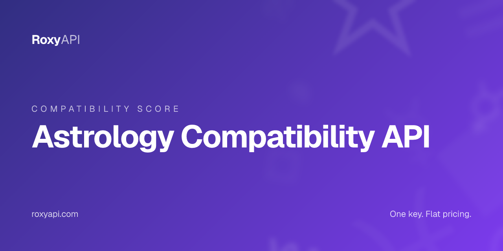

[](https://roxyapi.com/products/astrology-api)

# Astrology Compatibility API

> Scored astrology compatibility between two birth charts: overall 0-100, five category scores, sign pair narratives, element balance, and a relationship archetype. One key covers 18+ spiritual domains. MCP-first, verified against NASA JPL Horizons.

[](https://roxyapi.com/pricing)
[](https://roxyapi.com/api-reference)
[](https://roxyapi.com/methodology)
[](https://roxyapi.com/docs/mcp)
[](https://roxyapi.com/docs/sdk)

## What is Astrology Compatibility API

Astrology compatibility scores how two birth charts interact through Western synastry aspects. This repo ships working TypeScript, JavaScript, and Python samples against the RoxyAPI compatibility score endpoint, the consumer ready scored answer. The synastry endpoint carries the full practitioner inter-aspect table when you need depth. One subscription unlocks 18+ spiritual domains: Western astrology, Vedic astrology, Forecast, Human Design, Chinese astrology, Feng Shui, Mesoamerican astrology, Vastu, numerology, Kabbalah, tarot, biorhythm, Ayurveda, I Ching, crystals, dreams, angel numbers, and location. Every planetary position is computed by Roxy Ephemeris, verified against NASA JPL Horizons. The response returns an overall astrology compatibility score (0-100), five category scores, sign pair narratives, element balance, and a relationship archetype.

## Why this API

| Property | Value |
|----------|-------|
| Coverage | 18+ spiritual domains in one subscription |
| Calculation | Roxy Ephemeris, verified against NASA JPL Horizons |
| MCP server | `https://roxyapi.com/mcp/astrology` (Streamable HTTP, no local setup) |
| SDKs | TypeScript on npm `@roxyapi/sdk`, Python on PyPI `roxy-sdk`, PHP on Packagist `roxyapi/sdk`, C# on NuGet `RoxyApi.Sdk`, Go `github.com/RoxyAPI/sdk-go`, WordPress plugin `roxyapi` |
| Pricing | One key, flat per call, from $39/mo |
| Licensing | Personal and commercial use, including closed source apps. No AGPL or GPL entanglement. [Full terms](https://roxyapi.com/policy/license) |
| Last verified | 2026-Q3 |

## Quick start

1. Get a key at [roxyapi.com/pricing](https://roxyapi.com/pricing)
2. Pick a language below
3. Copy the snippet, run, ship

### cURL

```bash
# Step 1: geocode each birth city (run once per person)
curl -s "https://roxyapi.com/api/v2/location/search?q=New+York" \
  -H "X-API-Key: $ROXY_API_KEY"

# Step 2: call the endpoint with latitude, longitude, and timezone from cities[0]
curl -X POST https://roxyapi.com/api/v2/astrology/compatibility-score \
  -H "X-API-Key: $ROXY_API_KEY" \
  -H "Content-Type: application/json" \
  -d '{
    "person1": {
      "date": "1990-07-15",
      "time": "14:30:00",
      "latitude": 40.7128,
      "longitude": -74.006,
      "timezone": "America/New_York"
    },
    "person2": {
      "date": "1992-03-20",
      "time": "09:15:00",
      "latitude": 34.0522,
      "longitude": -118.2437,
      "timezone": "America/Los_Angeles"
    }
  }'
```

### Python

```python
import os
from roxy_sdk import create_roxy

roxy = create_roxy(os.environ["ROXY_API_KEY"])

# Compatibility: always geocode both birth cities first
loc1 = roxy.location.search_cities(q="New York")
city1 = loc1["cities"][0]

loc2 = roxy.location.search_cities(q="Los Angeles")
city2 = loc2["cities"][0]

# Scored compatibility between two birth charts
result = roxy.astrology.calculate_compatibility(
    person1={
        "date": "1990-07-15",
        "time": "14:30:00",
        "latitude": city1["latitude"],
        "longitude": city1["longitude"],
        "timezone": city1["timezone"],
    },
    person2={
        "date": "1992-03-20",
        "time": "09:15:00",
        "latitude": city2["latitude"],
        "longitude": city2["longitude"],
        "timezone": city2["timezone"],
    },
)

print(result["overallScore"], result["archetype"]["label"])
for name, score in result["categories"].items():
    print(name, score)
```

### JavaScript (Node)

```js
import { createRoxy } from '@roxyapi/sdk';

const roxy = createRoxy(process.env.ROXY_API_KEY);

// Compatibility: geocode both birth cities first, then score the two charts
const { data: loc1 } = await roxy.location.searchCities({ query: { q: 'New York' } });
const { data: loc2 } = await roxy.location.searchCities({ query: { q: 'Los Angeles' } });

const { data, error } = await roxy.astrology.calculateCompatibility({
  body: {
    person1: {
      date: '1990-07-15',
      time: '14:30:00',
      latitude: loc1.cities[0].latitude,
      longitude: loc1.cities[0].longitude,
      timezone: loc1.cities[0].timezone,
    },
    person2: {
      date: '1992-03-20',
      time: '09:15:00',
      latitude: loc2.cities[0].latitude,
      longitude: loc2.cities[0].longitude,
      timezone: loc2.cities[0].timezone,
    },
  },
});

if (error) throw new Error(error.error);

console.log('Overall score:', data.overallScore);
console.log('Archetype:', data.archetype.label);
console.log('Categories:', data.categories);
```

### TypeScript

```ts
import { createRoxy } from '@roxyapi/sdk';

const roxy = createRoxy(process.env.ROXY_API_KEY!);

// Compatibility: geocode both birth cities, then request the scored analysis
const { data: loc1 } = await roxy.location.searchCities({ query: { q: 'New York' } });
const { data: loc2 } = await roxy.location.searchCities({ query: { q: 'Los Angeles' } });

const { data, error } = await roxy.astrology.calculateCompatibility({
  body: {
    person1: {
      date: '1990-07-15',
      time: '14:30:00',
      latitude: loc1.cities[0].latitude,
      longitude: loc1.cities[0].longitude,
      timezone: loc1.cities[0].timezone,
    },
    person2: {
      date: '1992-03-20',
      time: '09:15:00',
      latitude: loc2.cities[0].latitude,
      longitude: loc2.cities[0].longitude,
      timezone: loc2.cities[0].timezone,
    },
  },
});

if (error) throw new Error(error.error);

console.log('Overall score:', data.overallScore);
console.log('Archetype:', data.archetype.label);
console.log('Romantic:', data.categories.romantic, 'Emotional:', data.categories.emotional);
console.log('Aspects:', data.aspectBreakdown.total, 'total,', data.aspectBreakdown.harmonious, 'harmonious');
data.keyAspects.slice(0, 3).forEach(a =>
  console.log(`${a.planet1} ${a.type} ${a.planet2} orb ${a.orb} [${a.interpretation}]`)
);
```

## Request schema

| Field | Type | Required | Description |
|-------|------|----------|-------------|
| `person1` | object | yes | First person birth details: `date`, `time`, `latitude`, `longitude`, `timezone`. Required for calculating natal planetary positions |
| `person1.date` | string | yes | Birth date in YYYY-MM-DD format. Determines planetary positions for the specific calendar day |
| `person1.time` | string | yes | Birth time in 24-hour HH:MM:SS format. Use 12:00:00 if unknown |
| `person1.latitude` | number | yes | Birth latitude in decimal degrees (-90 to 90). Positive = North. Call `/location/search` to get this |
| `person1.longitude` | number | yes | Birth longitude in decimal degrees (-180 to 180). Positive = East. Call `/location/search` to get this |
| `person1.timezone` | number or string | yes | Decimal hours from UTC (e.g. -5) or IANA name (e.g. "America/New_York"). IANA strings resolve to the DST-correct offset for the birth date, so pass `cities[0].timezone` from `/location/search` directly |
| `person2` | object | yes | Second person birth details. Same shape as `person1`. Compared against person1 to evaluate inter-chart aspects and compatibility |

## Response shape

```json
{
  "overallScore": 34,
  "categories": {
    "romantic": 38,
    "emotional": 39,
    "intellectual": 45,
    "physical": 34,
    "spiritual": 13
  },
  "persons": {
    "person1": {
      "sun": { "sign": "Cancer", "degree": 23.01 },
      "moon": { "sign": "Aries", "degree": 27.07 },
      "venus": { "sign": "Gemini", "degree": 24.74 },
      "mars": { "sign": "Taurus", "degree": 2.12 }
    },
    "person2": {
      "sun": { "sign": "Aries", "degree": 0.36 },
      "moon": { "sign": "Libra", "degree": 26.47 },
      "venus": { "sign": "Pisces", "degree": 8.3 },
      "mars": { "sign": "Aquarius", "degree": 24.3 }
    }
  },
  "signCompatibility": {
    "sun": {
      "person1Sign": "Cancer",
      "person2Sign": "Aries",
      "description": "Cancer and Aries combine water and fire core energy..."
    },
    "moon": { "person1Sign": "Aries", "person2Sign": "Libra", "description": "..." },
    "venus": { "person1Sign": "Gemini", "person2Sign": "Pisces", "description": "..." },
    "mars": { "person1Sign": "Taurus", "person2Sign": "Aquarius", "description": "..." }
  },
  "elementBalance": {
    "person1": { "fire": 3, "earth": 4, "air": 2, "water": 5 },
    "person2": { "fire": 3, "earth": 4, "air": 4, "water": 3 },
    "sharedElement": null,
    "description": "water and earth dominant energies complement each other..."
  },
  "archetype": {
    "label": "Growth Partners",
    "description": "This relationship is a catalyst for transformation..."
  },
  "strengths": ["Uranus-Jupiter Trine: ..."],
  "challenges": ["Pluto-Saturn Square: ..."],
  "summary": "Compatibility score: 34/100 (challenging). The 93 aspects between your charts...",
  "interpretation": "...",
  "aspectBreakdown": { "total": 93, "harmonious": 26, "challenging": 35, "neutral": 32 },
  "keyAspects": [
    {
      "planet1": "Pluto",
      "planet2": "Saturn",
      "type": "SQUARE",
      "orb": 0.09,
      "interpretation": "challenging",
      "description": "Pluto and Saturn create dynamic tension..."
    }
  ]
}
```

| Field | Type | Description |
|-------|------|-------------|
| `overallScore` | number | Overall compatibility score 0-100. Weighted average across romantic, emotional, intellectual, physical, and spiritual categories |
| `categories.romantic` | number | Romantic score based on Sun-Moon, Venus-Mars, and Sun-Venus inter-aspects |
| `categories.emotional` | number | Emotional score based on Moon-Moon and Moon-Venus inter-aspects |
| `categories.intellectual` | number | Intellectual score based on Mercury-Mercury and Sun-Mercury inter-aspects |
| `categories.physical` | number | Physical score based on Mars-Mars and Mars-Sun inter-aspects |
| `categories.spiritual` | number | Spiritual score based on Jupiter-Sun and Jupiter-Jupiter inter-aspects |
| `persons` | object | Key planet positions for both people: Sun, Moon, Venus, and Mars sign placements with degree |
| `signCompatibility` | object | Sign by sign narratives for Sun (core personality dynamic), Moon (emotional processing), Venus (love languages), and Mars (passion and conflict style) |
| `elementBalance` | object | Fire, earth, air, and water counts per chart plus `sharedElement` (null when dominant elements differ) and a narrative description |
| `archetype` | object | Relationship archetype `label` and `description`. One of eight: Kindred Spirits, Opposites Attract, The Power Couple, The Nurturers, The Adventurers, Growth Partners, The Balancers, The Mystics |
| `strengths` | array | Top relationship strengths from harmonious inter-chart aspects, each naming the planet pair and aspect type |
| `challenges` | array | Potential friction points from challenging inter-chart aspects, each with guidance for navigating the tension |
| `summary` | string | Narrative overview of the relationship compatibility, highlighting the dominant themes |
| `interpretation` | string | Detailed compatibility interpretation analyzing the synastry aspect patterns between both charts |
| `aspectBreakdown` | object | Inter-chart aspect counts: `total`, `harmonious` (trine, sextile), `challenging` (square, opposition), `neutral` (conjunction) |
| `keyAspects` | array | Most significant inter-chart aspects involving personal planets, sorted by strength. Each has `planet1`, `planet2`, `type`, `orb`, `interpretation`, `description` |

## Common use cases

| Use case | Endpoint flow |
|----------|---------------|
| Dating app match card with a single percent | Call `/location/search` twice, POST to `/astrology/compatibility-score`, display `overallScore` and `archetype.label` |
| Category radar chart | Plot the five `categories` scores: romantic, emotional, intellectual, physical, spiritual |
| Love compatibility widget with shareable copy | Show `summary`, the `signCompatibility` narratives, and `archetype.description` |
| Strengths and challenges card | Render `strengths[]` and `challenges[]` as two lists |
| Full practitioner synastry report | Switch to `POST /astrology/synastry` for the complete inter-aspect table with orbs and strength |

## Related endpoints in this domain

- `POST /astrology/synastry` (`calculateSynastry`) - full practitioner inter-aspect analysis: every aspect between the two charts with orb, strength, and meaning
- `POST /astrology/natal-chart` (`generateNatalChart`) - full natal chart per person with planet sign, house, and interpretation
- `POST /astrology/composite-chart` (`generateCompositeChart`) - midpoint composite chart describing the relationship itself as a third chart

## Use this in your AI agent

Connect Claude, GPT, Gemini, or Cursor to RoxyAPI through the remote MCP server. No Docker. No self hosting. The full MCP tool catalog for this domain is at `https://roxyapi.com/mcp/astrology`.

```json
{
  "mcpServers": {
    "astrology": {
      "url": "https://roxyapi.com/mcp/astrology",
      "headers": { "X-API-Key": "$ROXY_API_KEY" }
    }
  }
}
```

See [docs/mcp](https://roxyapi.com/docs/mcp) for Claude Desktop, Cursor, Windsurf, VS Code, and Claude Code setup.

## For AI coding agents

This repo ships an [AGENTS.md](AGENTS.md) execution playbook. Cursor, Claude Code, Aider, Codex, Windsurf, RooCode, and Gemini CLI will pick it up automatically. Top level overview lives at [roxyapi.com/AGENTS.md](https://roxyapi.com/AGENTS.md).

## Resources

- [Methodology and gold standard tests](https://roxyapi.com/methodology) verified against NASA JPL Horizons
- [Full API reference](https://roxyapi.com/api-reference) interactive Scalar UI
- [TypeScript SDK on npm](https://www.npmjs.com/package/@roxyapi/sdk)
- [Python SDK on PyPI](https://pypi.org/project/roxy-sdk/)
- [PHP SDK on Packagist](https://packagist.org/packages/roxyapi/sdk)
- [C# SDK on NuGet](https://www.nuget.org/packages/RoxyApi.Sdk)
- [Go SDK on pkg.go.dev](https://pkg.go.dev/github.com/RoxyAPI/sdk-go)
- [WordPress plugin](https://wordpress.org/plugins/roxyapi/)
- [llms.txt](https://roxyapi.com/llms.txt) full LLM citation index
- [Top level AGENTS.md](https://roxyapi.com/AGENTS.md)

## Other RoxyAPI samples

[](https://github.com/RoxyAPI/synastry-api)
[](https://github.com/RoxyAPI/natal-chart-api)
[](https://github.com/RoxyAPI/daily-horoscope-api)
[](https://github.com/RoxyAPI/kundli-matching-api)
[](https://github.com/RoxyAPI/numerology-api)

## License

MIT for this sample repo. See [LICENSE](LICENSE).

**Catalog licensing:** Personal and commercial use, including closed source proprietary apps. No AGPL or GPL entanglement. RoxyAPI APIs and SDKs are safe to embed in commercial products. Full terms at [roxyapi.com/policy/license](https://roxyapi.com/policy/license).

## Contact

- Site: [roxyapi.com](https://roxyapi.com)
- Status: [roxyapi.com/api-reference](https://roxyapi.com/api-reference)
